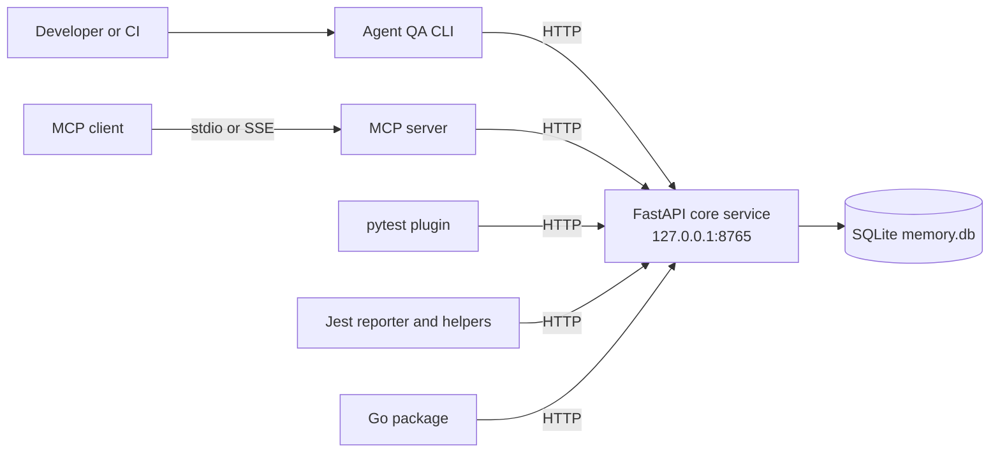

# Agent QA

Agent QA is a local-first test memory service for teams and coding tools that
need durable context across test runs. It stores reusable fixtures, API
contracts, failure diagnoses, execution history, and flaky-test quarantine
metadata in SQLite. A small REST service is the system of record; pytest, Jest,
Go, the CLI, and MCP clients use that service over HTTP.

The project is intended for local development and CI environments where the
test-memory database can remain close to the test process. It does not require
an external database or a hosted account.

## What it provides

- A FastAPI REST service on `127.0.0.1:8765`.
- A SQLite database with migrations, WAL mode, and full-text search.
- Automatic test-run recording for pytest and Jest.
- An aggregate Go `TestMain` helper plus explicit Go recording functions.
- Reusable fixtures and JSON Schema API contracts.
- Failure history, diagnosis, resolution, and search.
- Failure-frequency metrics and metadata-only quarantine decisions.
- A separate MCP server with stdio and SSE transports.
- A small CLI and Docker Compose deployment for local use.

## Architecture

The core service owns persistence and business rules. Integrations are kept
independent of the core implementation and communicate through the REST API.



The MCP process does not open the database or start the core service. Start the
core first, then let an MCP client launch the stdio server or connect to the SSE
endpoint.

## Requirements

- Python 3.11 or newer
- [Poetry](https://python-poetry.org/)
- SQLite with FTS5 support (the standard Python SQLite build normally includes it)
- Node.js 20 or newer for the Jest package
- Go 1.22 or newer for the Go package
- Docker and Docker Compose only when using the container deployment

## Quick start

From the repository root, install the core and integrations:

```bash
poetry --directory core install
poetry --directory plugins/pytest-agent-qa install
npm --prefix plugins/jest-agent-qa install
npm --prefix plugins/jest-agent-qa run build
go -C plugins/go-agent-qa test ./...
```

Start the core service in one terminal:

```bash
poetry --directory core run agent-qa-core
```

Verify that it is ready in another terminal:

```bash
curl --fail-with-body http://127.0.0.1:8765/v1/health
```

Run the pytest example:

```bash
poetry --directory plugins/pytest-agent-qa run pytest ../../examples/pytest_example
```

The Jest and Go examples have setup instructions in their own README files.

The default database is `~/.agent-qa/memory.db`, and logs are written beneath
`~/.agent-qa/logs`. Override the database location with `AGENT_QA_DB_PATH`.
Integrations use `AGENT_QA_CORE_URL` when an explicit URL is not supplied.

For a convenient local development stack, use `scripts/dev.sh` from a POSIX
shell. It starts the core service and MCP SSE server together. Docker users can
run `docker compose up --build`; see [deployment.md](docs/deployment.md) for
platform and volume details.

## Installation

### Core service and CLI

Install the core package and optional CLI independently:

```bash
poetry --directory core install
poetry --directory cli install
```

Start the core with `agent-qa-core`. The service applies supported database
migrations during startup and listens only on `127.0.0.1:8765`.

### pytest plugin

Install the plugin into the same Poetry environment that runs pytest:

```bash
poetry --directory plugins/pytest-agent-qa install
```

The package registers through the `pytest11` entry-point group. Run a project
with reporting enabled by default:

```bash
poetry --directory plugins/pytest-agent-qa run pytest path/to/tests
```

Use `--agent-qa-url` for an explicit service URL or `--agent-qa-disable` to
disable automatic reporting. The `agent_qa` fixture provides fixture and
contract helpers. See [plugins.md](docs/plugins.md) for the full API and
reporting semantics.

### Jest plugin

Build the package before installing it from a checkout:

```bash
npm --prefix plugins/jest-agent-qa install
npm --prefix plugins/jest-agent-qa run build
```

In a consumer project, install the local package and Jest peer dependency:

```bash
npm install --save-dev jest ts-jest typescript @types/jest
npm install ./path/to/Agent-QA/plugins/jest-agent-qa
```

Configure the reporter through the exported subpath:

```javascript
// jest.config.js
module.exports = {
  reporters: [
    "default",
    [
      "jest-agent-qa/reporter",
      {
        baseUrl: "http://127.0.0.1:8765",
        timeoutMs: 5000,
      },
    ],
  ],
};
```

The package targets Node 20+ and Jest 29 (the peer range is Jest 29 through
30). TypeScript tests still need a transformer such as `ts-jest`. Helpers such
as `rememberFixture` and `rememberContract` are exported from the package root.

### Go plugin

The Go integration uses only the standard library and requires Go 1.22+.
Its module path is:

```text
github.com/agent-qa/agent-qa/plugins/go-agent-qa
```

Validate the checked-out package with:

```bash
go -C plugins/go-agent-qa test ./...
```

In another Go module, add the package as a dependency with `go get`, then
import it as `github.com/agent-qa/agent-qa/plugins/go-agent-qa`. The exported
operations accept a `context.Context` and return `(JSONObject, error)`.
`NewTestMain` can record one aggregate package result; call `RecordTestRun`
explicitly when individual test history is required. See
[`examples/go_example/README.md`](examples/go_example/README.md).

## MCP client configuration

The MCP server is installed with the core package. Ensure the core is already
healthy, then configure an MCP client to launch the stdio process. If Poetry is
not on the client's executable path, use the absolute path to Poetry or to the
installed `agent-qa-mcp` executable.

Example stdio configuration:

```json
{
  "mcpServers": {
    "agent-qa": {
      "command": "poetry",
      "args": [
        "--directory",
        "/absolute/path/to/Agent-QA/core",
        "run",
        "agent-qa-mcp",
        "--transport",
        "stdio"
      ],
      "env": {
        "AGENT_QA_LOG_DIR": "/absolute/path/to/Agent-QA/.agent-qa/mcp-logs"
      }
    }
  }
}
```

MCP standard output is reserved for protocol messages; diagnostics go to
stderr and the configured log directory. Database settings such as
`AGENT_QA_DB_PATH` belong to the core process, not the MCP process.

For clients that support an SSE MCP server, start it separately:

```bash
poetry --directory core run agent-qa-mcp --transport sse --port 8766
```

Then configure the server URL as:

```text
http://127.0.0.1:8766/sse
```

Transport-specific details and all fourteen available tools are documented in
[mcp-tools.md](docs/mcp-tools.md).

## Documentation map

- [Architecture](docs/architecture.md) — service boundaries, storage, search,
  aggregation, and deployment design.
- [Framework integrations](docs/plugins.md) — pytest, Jest, and Go APIs.
- [MCP tools](docs/mcp-tools.md) — MCP transports, configuration, and tool
  reference.
- [REST API](docs/rest-api.md) — HTTP endpoints and payloads.
- [Deployment](docs/deployment.md) — configuration, Docker, backups, and
  operations.
- [Security policy](SECURITY.md) — local-service and sensitive-data guidance.

## Security and data handling

The REST service has no authentication and binds to loopback by design. Do not
expose it through a reverse proxy or wildcard interface without adding
authentication and authorization. Do not store credentials, tokens, private
keys, cookies, or production secrets in fixtures, contracts, failure messages,
stack traces, logs, or backups.

## Contributing

See [CONTRIBUTING.md](CONTRIBUTING.md) for development setup, checks, and pull
request expectations. The project is licensed under the MIT License; see
[LICENSE](LICENSE).
