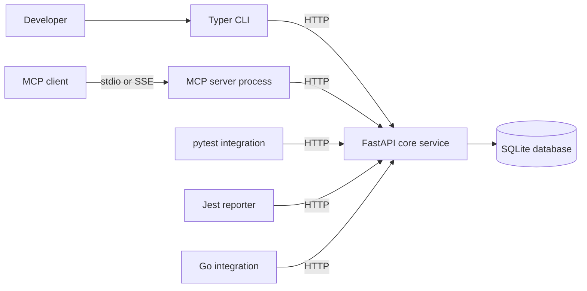
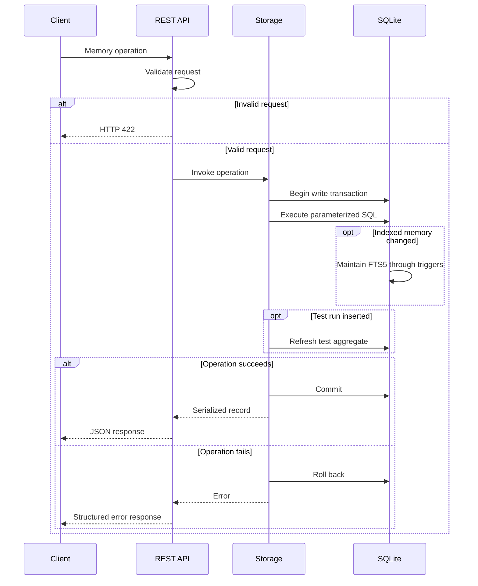
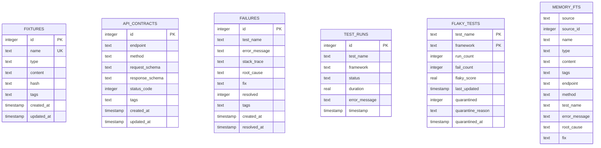
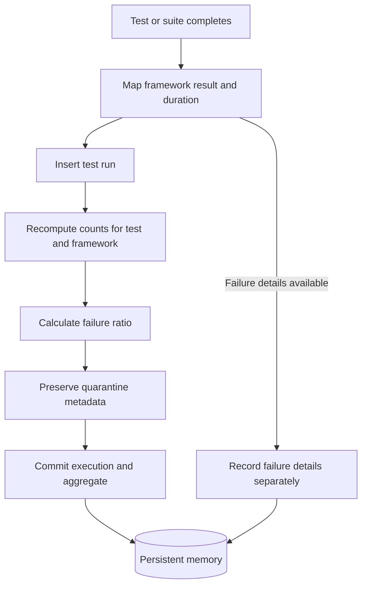
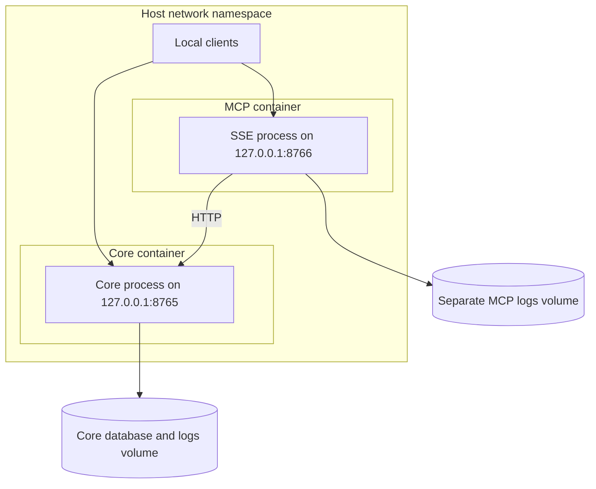

# Architecture

Agent QA provides persistent, local-first test memory for coding agents and
developers. Fixtures, API contracts, failure diagnoses, execution history, and
quarantine decisions survive individual test runs and development sessions.

## Component boundaries

The core service owns persistence and business rules. The CLI, MCP server,
and framework integrations communicate with it over HTTP.



### Core service

The core service binds to `127.0.0.1:8765` and provides:

- Validated REST endpoints under `/v1`.
- Health checks at `/health` and `/v1/health`.
- Automatic database migrations.
- Transactional memory operations.
- Full-text search.
- Failure-ratio aggregation after each test-run write.
- Persistent quarantine metadata.

The application lifespan opens storage during startup and closes it during
shutdown. Importing the application does not open the database.

### MCP server

The MCP server runs independently from the core service. It supports stdio
and SSE and exposes fourteen tools that forward to REST operations.

It uses shared configuration and logging utilities but does not access
storage or import the HTTP application's implementation. The core service
must already be running; the MCP server does not start it automatically.

The SSE listener defaults to `127.0.0.1:8766`.

### CLI

The CLI uses Typer and an independent HTTP client. It does not import core
service modules. If the core is unreachable, the client attempts to launch
`agent-qa-core` in the background.

The core executable must be available to the CLI process or configured through
`AGENT_QA_CORE_COMMAND`. Separate Poetry environments do not automatically
share installed executables.

### Framework integrations

Each integration translates framework-specific results into the core service's
HTTP payloads:

- pytest uses lifecycle hooks and provides the `agent_qa` fixture.
- Jest uses a reporter and exports fixture and contract helpers.
- Go provides context-aware functions and a package-level `TestMain` helper.

Automatic reporting is best-effort. Explicit helper operations return or raise
errors so calling tests can decide how to handle unavailable memory.

## Request lifecycle

Synchronous REST handlers execute storage operations without blocking the
application's asynchronous event loop.



Creation endpoints return HTTP `201`, including fixture and contract upserts.
Reads and other successful operations return HTTP `200`.

Missing singular records return `404`. Empty list queries return an empty
array. Validation failures return `422`, integrity conflicts return `409`,
and recognized SQLite locking errors return `503` with `Retry-After: 1`.

## Storage layout

The default database is `~/.agent-qa/memory.db`.
`AGENT_QA_DB_PATH` overrides its location.



Contracts have a composite unique constraint on
`(endpoint, method, status_code)`. Flaky aggregates use the composite primary
key `(test_name, framework)`.

The tables do not declare relational foreign keys between memory categories.
Test aggregation and FTS source references are maintained by application
operations and SQLite triggers.

### Connection settings

Storage requires a writable, file-backed SQLite database with FTS5 support.

- WAL journal mode is enabled during migration.
- Foreign-key enforcement is enabled on each application connection.
- Application connections use `synchronous=NORMAL`.
- The lock timeout defaults to five seconds.
- Connections are closed after each operation rather than retained in a pool.

WAL improves reader and writer coexistence, but SQLite still serializes
writers. The database should reside on a local filesystem suitable for SQLite
locking, not a shared network filesystem.

### Migrations

Migrations use SQLite's `user_version` to track the schema.

Startup obtains an immediate write transaction before checking and updating
the schema. This serializes concurrent migration attempts. A failed migration
rolls back its schema changes and version update.

The service rejects databases with a newer schema version than it supports.
It does not attempt automatic downgrades.

### Fixtures

Fixture names are globally unique within a database. Remembering an existing
name replaces mutable fields while preserving its ID and creation timestamp.

Content is stored as canonical JSON:

- Object keys are sorted recursively.
- Insignificant whitespace is omitted.
- Non-ASCII characters are escaped.
- Array order is preserved.
- Non-finite numbers are rejected.

The hash is the SHA-256 digest of the canonical UTF-8 representation.

### Contracts

Request and response schemas are checked as JSON Schema Draft 2020-12
documents before persistence. HTTP methods are normalized to uppercase.

When retrieval omits the status code, storage returns the lowest stored status
code for the endpoint and method.

Payload validation utilities resolve local references without fetching remote
resources. Schema validity does not guarantee that every external reference
will be resolvable when validating a payload.

### Failures

Each failure write creates a separate historical occurrence. Newly recorded
failures remain unresolved even when diagnosis fields are supplied.

Resolution updates the root cause and fix, marks the record resolved, and
preserves the first resolution timestamp on subsequent updates.

### Tags and timestamps

Tags are stored as comma-separated text and returned as arrays. Validation
rejects empty tags, embedded commas, and control characters. Duplicate tags
are removed while retaining their first occurrence.

SQLite timestamps represent UTC. Public responses serialize them as ISO 8601
strings ending in `Z`.

## Full-text search

`memory_fts` is one FTS5 virtual table covering three sources:

- Fixtures: name, type, content, and tags.
- Contracts: endpoint, method, and tags.
- Failures: test name, error message, root cause, fix, and tags.

The source and source identifier columns are not indexed. Insert, update, and
delete triggers maintain the index within the source transaction.

Queries are plain text. The service tokenizes, deduplicates, and quotes terms,
then combines them with `OR`. The resulting expression is supplied as a bound
SQL parameter, not interpolated into SQL.

Results are ranked using FTS5 BM25. Public scores negate SQLite's rank so
larger values correspond to stronger matches. Each result contains `source`,
`score`, and the complete `record`.

`suggest_test` uses this same retrieval mechanism. It returns relevant stored
memories rather than synthesizing test code.

## Test recording and flaky detection



Test-run insertion and aggregate refresh share one transaction. Failure
recording is a separate HTTP operation; partial delivery is possible if the
service becomes unavailable between requests.

The score is:

```text
flaky_score = fail_count / run_count
```

All recorded statuses contribute to `run_count`. Only `failed` and `error`
contribute to `fail_count`.

Classification uses an inclusive threshold and excludes empty histories.
At threshold zero, passing histories qualify. Consistently failing tests also
qualify; the detector measures failure frequency rather than proving
intermittency.

The REST endpoint uses `AGENT_QA_FLAKY_THRESHOLD` when its threshold is omitted.
The MCP tool and CLI currently supply their own default of `0.3`.

### Framework granularity

pytest records one result per test protocol, combining setup, call, and
teardown. Setup or teardown failures become `error`.

Jest records individual assertion results. A suite execution failure with no
assertions becomes a suite-level `error` record.

Go's `NewTestMain` records an aggregate package execution under the name
`go-test-suite`. It does not observe individual test outcomes. Projects needing
per-test history should call `RecordTestRun` explicitly with distinct names.

### Quarantine

Quarantine requires existing recorded history. It stores a reason and
timestamp on the aggregate. Subsequent aggregation preserves those fields.

Quarantine does not skip tests or change the failure ratio.

## Deployment and observability



Compose uses host networking so both processes share the required loopback
addresses. This requires Linux host networking or compatible Docker Desktop
configuration. Ordinary port publishing does not expose a listener bound only
to a container's loopback interface.

Containers use a non-root account, dropped capabilities, a read-only root
filesystem, and writable volumes for persistent data. The MCP process has a
separate log volume and does not mount the database.

Core and MCP logging uses JSON on stderr and a rotating `agent-qa.log` file.
When running both processes directly, use separate `AGENT_QA_LOG_DIR` values:
standard rotating file handlers do not coordinate rotation across processes.

The REST service has no authentication. Loopback binding limits network
exposure but does not authorize individual local processes. Treat fixtures,
failure details, database files, and backups as potentially sensitive data.

For operational instructions, see [deployment.md](deployment.md).
For interface details, see [rest-api.md](rest-api.md) and
[mcp-tools.md](mcp-tools.md).